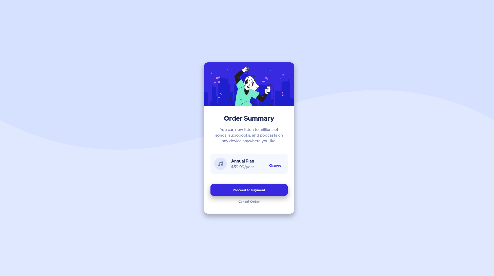

# Frontend Mentor - Order summary card solution

This is a solution to the [Order summary card challenge on Frontend Mentor](https://www.frontendmentor.io/challenges/order-summary-component-QlPmajDUj). Frontend Mentor challenges help you improve your coding skills by building realistic projects. 

## Table of contents

- [Overview](#overview)
  - [The challenge](#the-challenge)
  - [Screenshot](#screenshot)
  - [Links](#links)
- [My process](#my-process)
  - [Built with](#built-with)
  - [What I learned](#what-i-learned)
  - [Useful resources](#useful-resources)
- [Author](#author)

**Note: Delete this note and update the table of contents based on what sections you keep.**

## Overview

### The challenge

Users should be able to:

- See hover states for interactive elements

### Screenshot



### Links

- Solution URL: [Github Pages](https://appithe.github.io/Frontend-Mentor/order-summary-component-main/)

## My process

### Built with

- Semantic HTML5 markup
- CSS custom properties
- Flexbox
- Media queries
- Mobile-first workflow

### What I learned

- Box shadow
```css
.container {
    background: white;
    width: 350px;
    border-radius: 15px;
    text-align: center;
    box-shadow: 0px 10px 20px 1px rgba(0, 0, 0, 0.3);
}
```

- Media queries
```css
@media only screen and (max-width: 375px) {
    body {
        background: var(--pale-blue) url(./images/pattern-background-mobile.svg) no-repeat top/100%;
    }
}
```

### Useful resources

- [Media queries](https://developer.mozilla.org/es/docs/Web/CSS/Media_Queries/Using_media_queries) - This helped to change the background when the screen is less than 375px.
- [Example resource 2](https://developer.mozilla.org/es/docs/Web/CSS/box-shadow) - This helped to add a shadow on some components

## Author

- Joel Avilés
- Frontend Mentor - [@Appithe](https://www.frontendmentor.io/profile/Appithe)
- Twitter - [@joelaviles413](https://twitter.com/joelaviles413)


